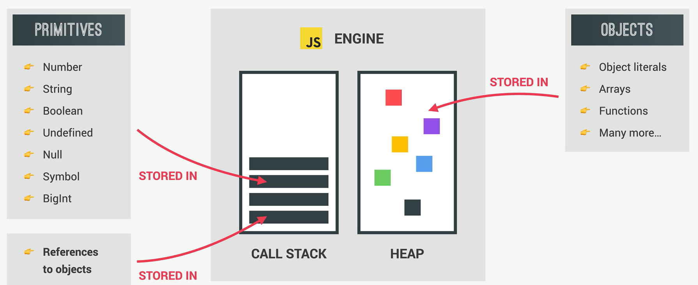

# Memory Management

Se refiere a como JavaScript maneja el almacenamiendo de variables y después libera ese espacio cuando ya no se necesita

Todo lo que se crea en JavaScript va a un lugar que se llama Ciclo de Vida de Memoria (Memory Lifecicly)

1. Se asigna un lugar en memoria cuando se crea un valor
2. Mientras se está ejecutando el código, el valor es escrito, leído y en el espacio de memoria asignado
3. Se libera el espacio en memoria cuando ya no se necesita

# Asignación de Memoria
### Memory Allocation
En JS solo existen 2 tipos de valores: 
Primitivos y Objetos

