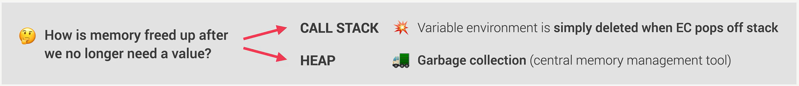
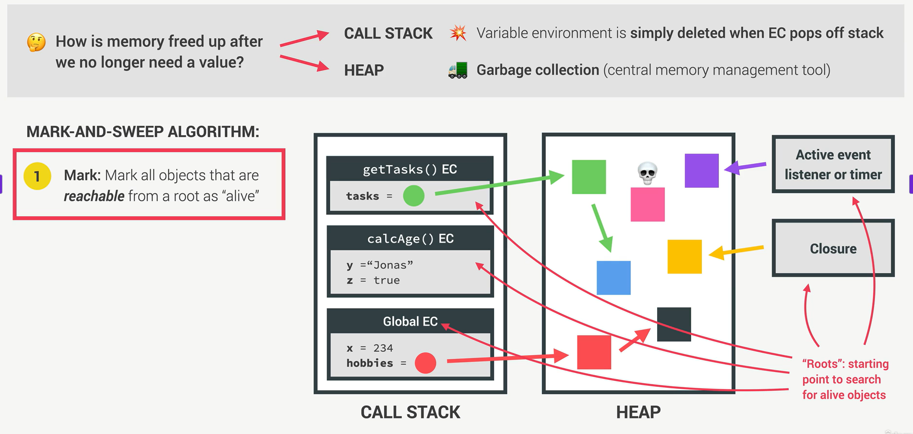
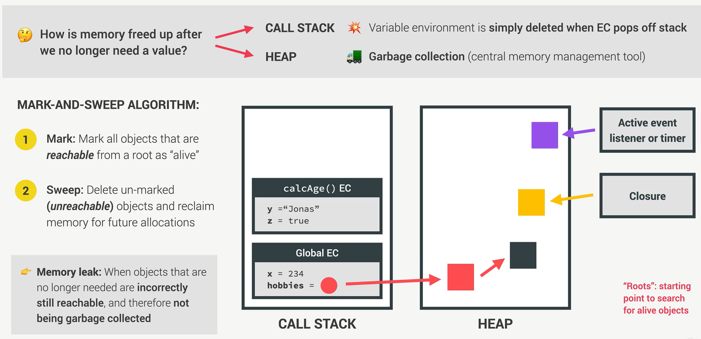

# LIMPIEZA DEL CALL STACK

Se libera la memoria al mismo tiempo que se elimina el contexto de ejecución de cada función, y con esto también se eliminan las variables dentro de cada función.

Las variables creadas en el contexto global **(Global Context)** se quedan almacenadas mientras se ejecuta todo el código.

# LIMPIEZA DEL HEAP

Para la limpieza del **HEAP** se usa un algoritmo llamado `MARK-AND-SWEET`

1. **MARK** (hace refencia a los objetos 'marcados', **reachable** en inglés)

    La primer fase del algoritmo es que busca todos los objetos, funciones, arrays, sets o maps que están en el HEAP, y si tienen una referencia, esto significa que para el algoritmo, estas estructuras de datos se encuentran **vivas**.

    Las estructuras de datos que están en la memoria HEAP, solo son una refencia del CALL STACK pero también pueden haber otras refencias como los `event listener` o `timer` y también `closure`

    A diferencia que al objeto rosado en la imagen, no tiene una refencia, el algoritmo da como **muerto** este objeto ya que no tiene una refencia.

2. **Sweet** (hace refencia a los objetos no 'marcados', **unreachable**)

    La limpieza con la fase **Sweet** lo que hace es buscar los objetos que no tienen una refencia y serán eliminados.

    Las estructuras de datos que tengan una refencia del contexto global, no serán eliminadas. A esto se refiere el **Memory Leak**

