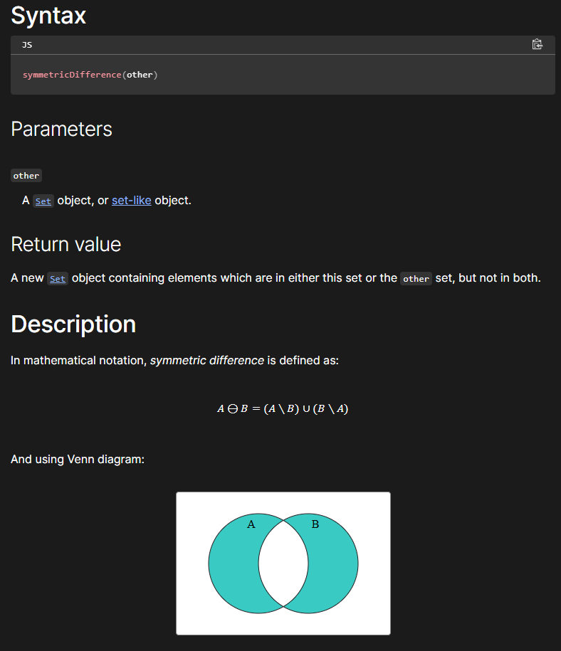
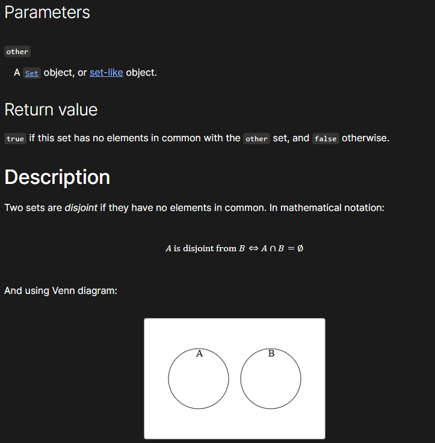
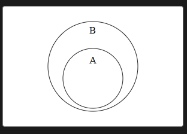

# SETS

### Un set es una colección de valores únicos

#### Antes del 2,025 los SETS solo tenían 4 métodos: "HAS, ADD, DELETE, CLEAR"

#### Ahora tiene 7 nuevos métodos: "INTERSECTION, 

Eso signifca que no puede tener valores duplicados.

Este tipo de dato se agregó en ES6

Su sintaxis es la misma que un array usando '[ ]' pero sus métodos son diferentes por ejemplo 'size' para ver el tamaño (longitud).

En este ejemplo está 2 veces el valor de Pizza pero como no permite los valores duplicados, solo los imprime una vez y muestra 3 resultados.


```javascript

const nuevoSet = new Set(['Pizza', 'Hamburguesa', 'Pasta', 'Pizza']);
console.log(nuevoSet); // Set(3) { 'Pizza', 'Hamburguesa', 'Pasta' }

/*

Resultado:

Set(3) { 'Pizza', 'Hamburguesa', 'Pasta' }

*/

```

### Los STRINGS también son SET porque es una colección de valores únicos que juntos forman un nombre

```javascript

console.log(new Set('Bryan')); // Set(4) { 'B', 'r', 'y', 'a', 'n' }

```

## Método HAS

Este método es parecido al 'INCLUDES' usado en los arreglos.

```javascript

const nuevoSet = new Set(['Pizza', 'Hamburguesa', 'Pasta', 'Pizza']);

console.log(nuevoSet.has('Pizza')); // true
console.log(nuevoSet.has('Pan')); // false

```

## Método ADD


```javascript

nuevoSet.add('Pan');

// Resultado: 
// Set(4) { 'Pizza', 'Hamburguesa', 'Pasta', 'Pan' }

```

Si agregamos de nuevo la 'pizza', no la reconoce porque ese valor ya existe y no admite valores duplicados.


```javascript

nuevoSet.add('Pizza');

// Resultado: 
// Set(4) { 'Pizza', 'Hamburguesa', 'Pasta', 'Pan' }

```

## Método DELETE

```javascript

nuevoSet.delete('Pizza'); // Elimina 'Pizza'
console.log(nuevoSet); // Set(3) { 'Hamburguesa', 'Pasta', 'Pan' }

```

No podemos acceder a los valores de un SET usando sus índices ya que por eso es que están ordenados los valores. 

En ese caso usamos el método HAS

Si necesitamos acceder a los valores a través de su índice, es mejor usar ARRAYS

```javascript

console.log(nuevoSet[2]); // undefined

```

## Método CLEAR

```javascript

console.log(nuevoSet); // Set {}

```

### Podemos iterar

```javascript

for (const comida of nuevoSet) {
    console.log(comida)};

// Set(3) { 'Hamburguesa', 'Pasta', 'Pan' }

```

### Podemos usar el SPREAD OPERATOR y convertir un SET en un array

```javascript

const frutas = ['Manzana', 'Naranja', 'Pera', 'Manzana', 'Sandía', 'Naranja'];

const frutasUnicas = new Set(frutas);
console.log(frutasUnicas); // Set(4) { 'Manzana', 'Naranja', 'Pera', 'Sandía' }

```
## Aquí el SPREAD ' . . . '

```javascript

const frutasUnicas2 = [...new Set(frutas)];
console.log(frutasUnicas2); // [ 'Manzana', 'Naranja', 'Pera', 'Sandía' ]

```
# Nuevos métodos

## Intersection

Creamos 2 objetos y usamos el método INSERSECTION ( )

```javascript

const italianFoods = new Set([
    'pasta',
    'gnocchi',
    'tomatoes',
    'olive oil',
    'garlic',
    'basil',
]);

const mexicanFoods = new Set([
    'tortillas',
    'beans',
    'rice',
    'tomatoes',
    'avocados',
    'garlic'
]);

const commonFoods = italianFoods.intersection (mexicanFoods);
console.log(commonFoods); // Set { 'tomatoes', 'garlic' }
```

#### Para este punto ya tenemos el objeto 'commonFoods' que tiene los elementos en común.
Ahora vamos a pasar ese objeto a un array.

Aqui usamos el SPREAD ' . . . '

```javascript

console.log([...commonFoods]); 

// Resultado:

// [ 'tomatoes', 'garlic' ]

```

## Union

#### Lo que hace este método es unir ambos objetos pero sin valores duplicados

```javascript

const italianFoods2 = italianFoods.union (mexicanFoods);
console.log(italianFoods2); 

// Set { 'pasta', 'gnocchi', 'tomatoes', 'olive oil', 'garlic', 'basil', 'tortillas', 'beans', 'rice', 'avocados' }

```

### Convertir los objetos en un array con valores únicos

```javascript

console.log([...new Set([...italianFoods, ...mexicanFoods])]);

/*
Array(10) [ 'pasta', 'gnocchi', 'tomatoes', 'olive oil', 'garlic', ... ]
[ 'pasta', 'gnocchi', 'tomatoes', 'olive oil', 'garlic', 'basil', 'tortillas', 'beans', 'rice', 'avocados' ]

 */

```
## Difference

Lo que muestra son los valores diferentes del primer objeto.

```javascript

const italianFoods3 = italianFoods.difference (mexicanFoods);
console.log(italianFoods3); 

// Set { 'pasta', 'gnocchi', 'olive oil', 'basil' }

```

Ver enlace:

https://developer.mozilla.org/en-US/docs/Web/JavaScript/Reference/Global_Objects/Set/difference

## symmetricDifference ( )

Muestra los valores que no tienen en común ambos objetos

```javascript

const evens = new Set([2, 4, 6, 8]);
const squares = new Set([1, 4, 9]);
console.log(evens.symmetricDifference(squares)); 

// Set(5) { 2, 6, 8, 1, 9 }

```


## isDisjointFrom
### Syntax

```javascript
isDisjointFrom(other)
```

Es un método que se usa con instancias de Set. Este método toma otro conjunto (other) como parámetro y devuelve un valor booleano:

1. true si el conjunto original no tiene elementos en común con el conjunto dado.

2. false si ambos conjuntos comparten al menos un elemento.

Explicación matemática:
Se dice que dos conjuntos son disjuntos si no tienen elementos en común. En notación matemática:

A ∩ B = ∅, lo que significa que la intersección de A y B es el conjunto vacío.



## isSubsetOf

Es un método que verifica si todos los elementos del conjunto sobre el cual se invoca el método (this set) están presentes en otro conjunto (other).

1. Devuelve true si todos los elementos del conjunto original también están en el conjunto dado.

2. Devuelve false si al menos un elemento del conjunto original no está en el conjunto dado.

RESUMEN:

TRUE si lo elementos de ESTE set están en el otro set

```javascript

// Múltiplos de 4 menos a 20
const fours = new Set([4, 8, 12, 16]);
const pares = new Set([2, 4, 6, 8, 10, 12, 14, 16, 18]);
console.log(fours.isSubsetOf(pares)); // true

```


## isSupersetOf

True si todos los elementos del OTRO set, están en este set.

Todos los elementos que tiene 'fours' están en 'pares'

```javascript

const pares = new Set([2, 4, 6, 8, 10, 12, 14, 16, 18]);
const fours = new Set([4, 8, 12, 16]);
console.log(pares.isSupersetOf(fours)); // true

```

